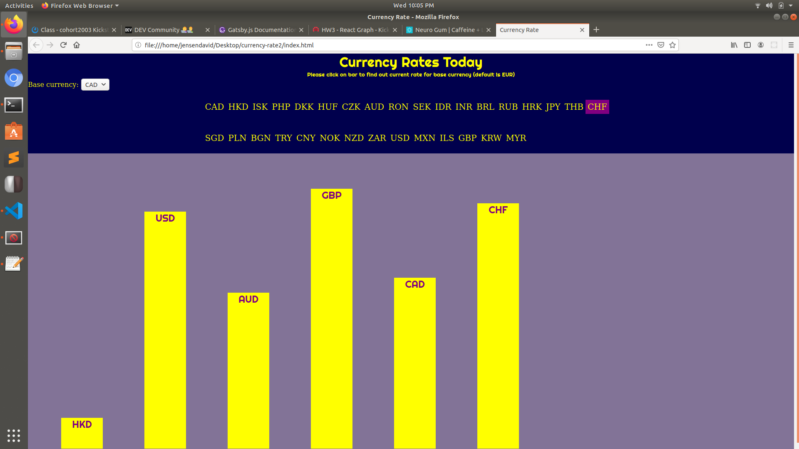

# currency-rate2

This is homework 2 for the Kickstart Coding front-end curriculum.

It is a bar graph with of the currency rate from data fetched from the exchange rates API. Javascript is applied for a degree of interaction when base currency is changed.

API: https://api.exchangeratesapi.io/latest

Clicking on an individual graph will alert the user of the current rate of the base currency against the currency targeted.

Here is a screenshot of the bar graph in action.

